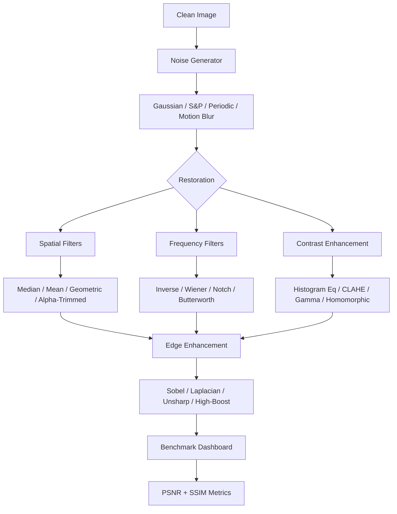

# UAV Image Restoration Pipeline

**Degraded UAV Imagery Restoration and Target Enhancement**

[](https://www.python.org/)
[](LICENSE)
[]()
[](https://github.com/mehmetd7mir/UAVImageRestoration/actions)

> Complete image processing pipeline for restoring degraded UAV camera imagery and enhancing targets. Covers noise removal, blur correction, contrast enhancement, and edge detection.

---

## Pipeline Overview



## Modules

| Module | Description | Key Methods |
|--------|-------------|-------------|
| **Noise Modeling** | Synthesize degraded UAV images | Gaussian, Salt-Pepper, Periodic, Motion Blur |
| **Spatial Restoration** | Pixel-domain filtering | Median, Arithmetic Mean, Geometric Mean, Alpha-Trimmed |
| **Frequency Restoration** | DFT-based restoration | Inverse Filter, Wiener Filter, Notch, Butterworth LP/HP |
| **Contrast Enhancement** | Improve visibility | Histogram EQ, CLAHE, Gamma Correction, Homomorphic Filter |
| **Edge Enhancement** | Target boundary detection | Sobel, Laplacian, Unsharp Mask, High-Boost |
| **Benchmark** | Compare all methods | PSNR, SSIM, Processing Time, Visual Comparison |

## Quick Start

```bash
# install dependencies
pip install -r requirements.txt

# run full demo (all modules)
python main.py --demo

# run specific module
python main.py --module noise
python main.py --module spatial
python main.py --module frequency
python main.py --module enhancement
python main.py --module edge

# run benchmark with comparison plots
python main.py --benchmark
```

### Example Output

```
==================================================
  UAV Image Restoration Pipeline
==================================================

[Module 2] Spatial Domain Restoration
  Noisy (S&P):     PSNR=18.3 dB
  median             PSNR=33.1 dB, SSIM=0.9312
  arithmetic_mean    PSNR=26.4 dB, SSIM=0.8541
  geometric_mean     PSNR=25.8 dB, SSIM=0.8320
  alpha_trimmed      PSNR=30.2 dB, SSIM=0.9105
```

## Project Structure

```
UAVImageRestoration/
├── main.py                          # CLI entry point
├── src/
│   ├── noise/
│   │   └── noise_generator.py              # degradation models
│   ├── spatial/
│   │   └── spatial_filters.py              # spatial domain restoration
│   ├── frequency/
│   │   └── freq_filters.py                 # frequency domain restoration
│   ├── enhancement/
│   │   └── contrast.py                     # contrast enhancement
│   ├── edge/
│   │   └── edge_detection.py               # edge and target enhancement
│   ├── metrics/
│   │   └── quality.py                      # PSNR, SSIM, timing
│   └── benchmark/
│       └── dashboard.py                    # benchmark pipeline
├── tests/                           # 74 unit tests
├── results/                         # generated comparison images
├── docs/                            # documentation
└── .github/workflows/               # CI pipeline
```

## Running Tests

```bash
pip install pytest
pytest tests/ -v
```

## Key Concepts

### Why This Matters for UAV Imagery

| Problem | Cause | Solution |
|---------|-------|----------|
| Gaussian noise | Sensor electronics | Mean / Wiener filter |
| Salt-pepper noise | Transmission errors | Median filter |
| Motion blur | Aircraft movement | Inverse / Wiener deconvolution |
| Periodic noise | Electronic interference | Notch filter |
| Low contrast | Poor lighting, haze | CLAHE, Homomorphic filter |
| Unclear targets | Noise + blur | Unsharp masking, High-boost |

## Tech Stack

| Component | Technology |
|-----------|------------|
| **Core** | NumPy, SciPy |
| **Image Processing** | OpenCV, scikit-image |
| **Visualization** | Matplotlib |
| **Metrics** | PSNR, SSIM (scikit-image) |
| **Data** | Pandas |
| **Testing** | pytest |

## Course Context

This project was developed as part of my **Digital Image Processing** coursework. Each module directly applies concepts from the textbook:

| Module | Textbook Chapters | What I Learned |
|--------|-------------------|----------------|
| Noise Modeling | Ch. 8 — Noise Models | How different noise types affect images and how to model them mathematically |
| Spatial Filters | Ch. 4, 8 — Spatial Filtering | Why median filter beats mean filter for impulse noise, and how alpha-trimmed handles mixed noise |
| Frequency Filters | Ch. 6, 7, 9 — Frequency Domain | DFT-based image processing, why inverse filtering amplifies noise and Wiener filtering solves this |
| Contrast Enhancement | Ch. 3 — Intensity Transforms | Histogram equalization theory, how homomorphic filtering separates illumination from reflectance |
| Edge Detection | Ch. 4, 7 — Edge Detection | First vs second derivatives for edge detection, unsharp masking as a sharpening technique |
| Benchmark | Ch. 8 — Image Quality | PSNR and SSIM as standard quality metrics, how to objectively compare restoration methods |

> The UAV imagery context connects this coursework to real-world defense applications where degraded sensor data must be restored for target identification.

## References

- Gonzalez & Woods, *Digital Image Processing* (4th Edition)
- [DOTA Dataset](https://captain-whu.github.io/DOTA/) — Large-scale aerial image dataset
- [VEDAI Dataset](https://downloads.greyc.fr/vedai/) — Vehicle detection in aerial imagery

## Author

**Mehmet Demir** - [GitHub](https://github.com/mehmetd7mir)
